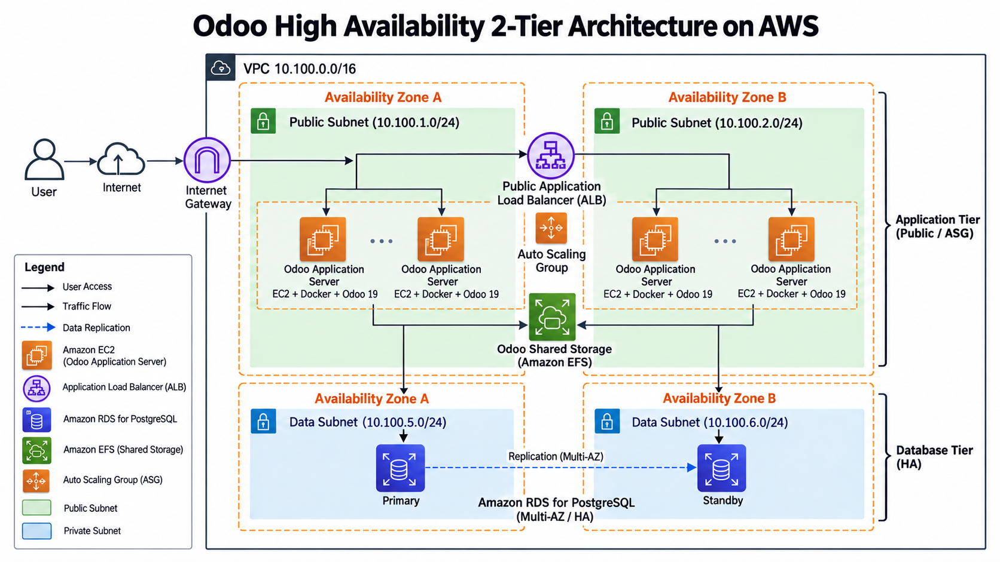
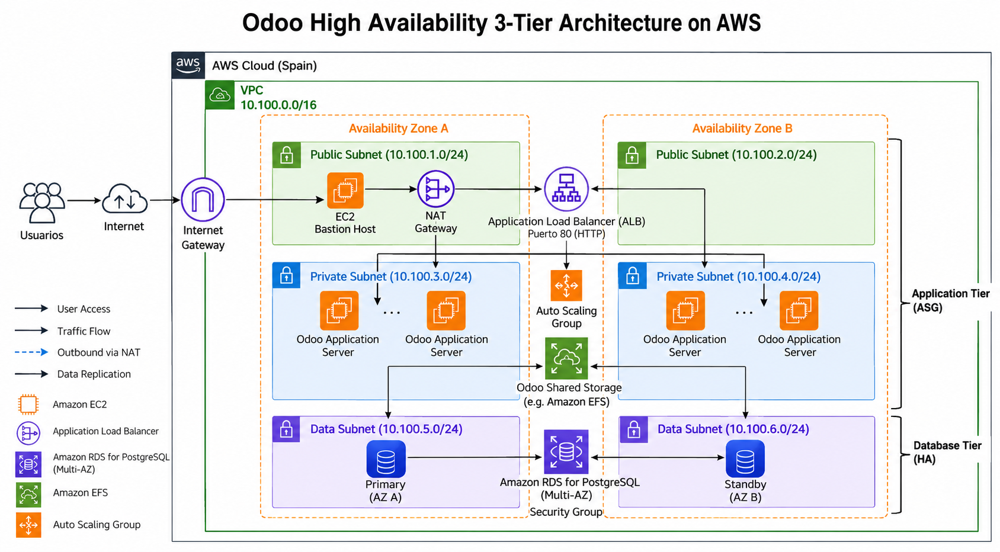

## 2 Tier Architecture

## 3 Tier Architecture


## Create VPC Odoo
```
CIDR: 10.100.0.0/16
6 Subnets: 10.100.x.0/24
1 NAT GW
```
## Create 4 SG
```
SGec2: 22 y 80
SGalb: 80
SGefs: 2049
SGpostgres: 5432
```
## Create RDS Postgress 
```
User: odoo
Password A123456b
BBDD: odoo
```
## Instalar odoo_ec2_01_inicializar-sh  
## Instalar odoo_ec2_02_y_siguientes

## Login
```
user/email: admin
password: admin
```

## TG - ALB
```
Pon el health check así:
Protocol: HTTP
Port: traffic port
Path: /web/login
Success codes: 200-399
```
