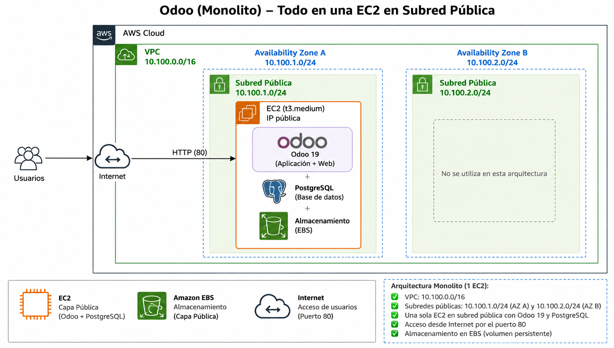

# Odoo - Monolito
## Fedora User-data: odoo_ec2_00_Monolito.sh


# 2 Tier Architecture
## Ubuntu User-data: odoo_ec2_01_inicializar.sh y odoo_ec2_02_y_siguientes.sh


# 3 Tier Architecture
## Ubuntu User-data: odoo_ec2_01_inicializar.sh y odoo_ec2_02_y_siguientes.sh


## Create VPC Odoo
```
CIDR: 10.100.0.0/16
6 Subnets: 10.100.x.0/24
1 NAT GW
```
## Create 4 SG
```
SGec2: 22 y 80
SGalb: 80
SGefs: 2049
SGpostgres: 5432
```
## Create RDS Postgress 
```
User: odoo
Password A123456b
BBDD: odoo
```
## Install odoo_ec2_01_inicializar.sh  
## Install odoo_ec2_02_y_siguientes.sh

## Login
```
user/email: admin
password: admin
```

## TG - ALB
```
Pon el health check así:
Protocol: HTTP
Port: traffic port
Path: /web/login
Success codes: 200-399
```
